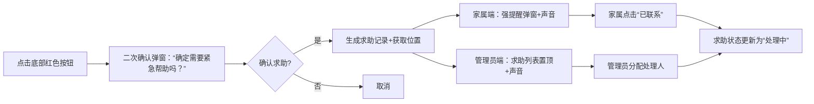
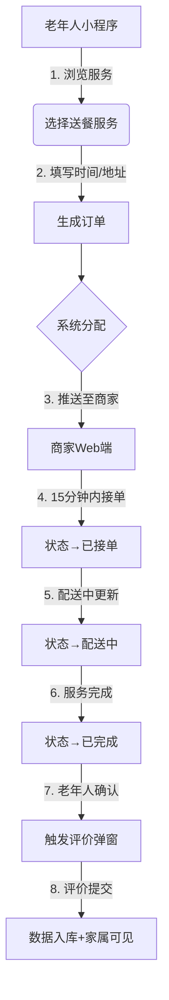
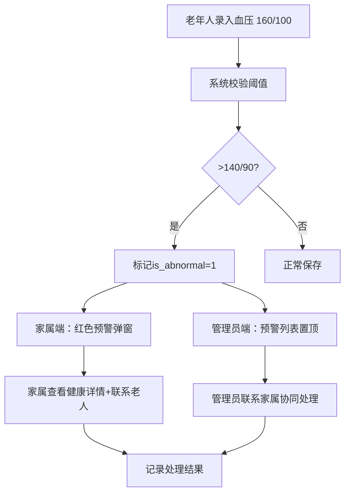

# 小区老年人服务管理系统 — 产品需求文档（PRD V1.0）

> **文档说明**：本PRD基于本科毕业设计任务书与开题报告要求编写，采用**账号密码认证体系**（非手机号），设计“小程序（老年人端）+ 统一Web后台（商家/家属/管理员三角色）”架构，聚焦健康监测、生活服务、家属协同三大核心场景，适配6个月毕设开发周期。

---

## 一、文档基本信息

| 项目         | 内容                                            |
| ------------ | ----------------------------------------------- |
| **产品名称** | 小区老年人服务管理系统                          |
| **文档类型** | 产品需求文档（PRD）                             |
| **版本号**   | V1.0                                            |
| **创建日期** | 2026年2月7日                                    |
| **适用对象** | 开发团队、指导教师、答辩评审                    |
| **认证方式** | 账号（username）+ 密码（非手机号）              |
| **核心修正** | 任务书中“监考检测”为笔误，实际为 **“健康监测”** |

---

## 二、产品概述

### 2.1 产品定位

> 面向小区场景的轻量化智慧养老服务平台，通过**多角色协同机制**连接老年人、家属、社区商家与小区管理员，实现“健康监测-生活服务-紧急求助-家属协同”一体化管理。

### 2.2 核心价值主张

| 价值维度          | 具体体现                                                                |
| ----------------- | ----------------------------------------------------------------------- |
| **健康-服务联动** | 健康数据异常时自动推荐关联服务（如血压异常→推荐上门医护）               |
| **多角色协同**    | 四方信息实时同步，打破服务孤岛（老人预约→商家接单→家属监督→管理员监管） |
| **适老化交互**    | 字体放大、语音辅助、一键求助等设计降低老年人使用门槛                    |
| **轻量化落地**    | 无需硬件对接，手动录入+阈值预警实现健康监测（符合毕设可行性）           |

### 2.3 产品目标

| 目标类型     | 具体指标                                                |
| ------------ | ------------------------------------------------------- |
| **业务目标** | 老年人服务预约效率提升50%，健康异常响应时间≤5分钟       |
| **用户目标** | 老年人独立完成核心操作（预约/健康录入）成功率≥90%       |
| **毕设目标** | 完成可运行系统 + 1.5-2万字论文 + 通过答辩（重复率≤30%） |

---

## 三、用户角色与权限体系

### 3.1 四类用户画像

| 角色           | 账号前缀    | 核心诉求                       | 使用频率  | 关键场景                             |
| -------------- | ----------- | ------------------------------ | --------- | ------------------------------------ |
| **老年人**     | `elderly_`  | 便捷获取服务、紧急情况快速求助 | 每日1-3次 | 预约送餐、录入血压、突发头晕求助     |
| **家属**       | `family_`   | 实时掌握老人状况、远程监督服务 | 每日1次   | 查看健康数据、接收异常预警、监督订单 |
| **社区商家**   | `merchant_` | 高效接单、管理商品/服务        | 每日多次  | 处理订单、上架商品、更新库存         |
| **小区管理员** | `admin_`    | 资源调配、数据监控、系统维护   | 每日1次   | 审核用户/服务、查看统计报表          |

> 💡 **账号规则示例**：
>
> - 老年人：`elderly_zhangsan`、`elderly_lisi`
> - 家属：`family_zhangsan_son`（关联张三老人的儿子）
> - 商家：`merchant_community_restaurant`、`merchant_community_pharmacy`
> - 管理员：`admin_xiaoqu01`（系统初始化时预置）

### 3.2 权限控制矩阵

| 功能模块         | 老年人（小程序）      | 家属（Web）           | 社区商家（Web）       | 小区管理员（Web）          |
| ---------------- | --------------------- | --------------------- | --------------------- | -------------------------- |
| **账号登录**     | ✅ 账号+密码          | ✅ 账号+密码          | ✅ 账号+密码          | ✅ 账号+密码               |
| **个人信息管理** | ✅ 查看/编辑基础信息  | ✅ 查看关联老人信息   | ✅ 商家资料维护       | ✅ 全用户信息管理/重置密码 |
| **服务浏览**     | ✅ 分类浏览/搜索      | ✅ 查看老人可预约服务 | ❌                    | ✅ 全量服务审核/下架       |
| **服务预约**     | ✅ 选择时间/地址/备注 | ❌                    | ❌                    | ❌                         |
| **订单管理**     | ✅ 查看/确认收货/评价 | ✅ 查看进度/评价      | ✅ 接单/拒单/状态更新 | ✅ 全订单监控/强制取消     |
| **健康数据**     | ✅ 手动录入+查看历史  | ✅ 实时查看+趋势图    | ❌                    | ✅ 异常预警列表/导出       |
| **紧急求助**     | ✅ 一键触发           | ✅ 接收通知+快速联系  | ❌                    | ✅ 接收通知+处理/分配      |
| **数据统计**     | ❌                    | ❌                    | ❌                    | ✅ 用户/订单/健康多维报表  |

> ✅ **架构决策**：家属、商家、管理员三端**共用一套Web系统**，通过角色权限动态控制菜单与数据访问范围（详见第5章）。

---

## 四、功能需求详细说明

### 4.1 全局基础功能（P0 必做）

#### 4.1.1 账号认证体系

| 功能点       | 详细规则                                                                                                                                                                                                                                                                                                           | 技术实现                                                              |
| ------------ | ------------------------------------------------------------------------------------------------------------------------------------------------------------------------------------------------------------------------------------------------------------------------------------------------------------------ | --------------------------------------------------------------------- |
| **账号规则** | - 老年人：`elderly_` + 英文名/拼音（如 `elderly_zhangsan`）<br>- 家属：`family_` + 关联老人账号 + 关系（如 `family_zhangsan_son`）<br>- 商家：`merchant_` + 商家类型 + 编号（如 `merchant_restaurant_01`）<br>- 管理员：`admin_` + 小区编号（如 `admin_xiaoqu01`）<br>**长度**：4-20字符，仅支持字母、数字、下划线 | 前端表单校验 + 后端正则验证                                           |
| **密码规则** | 长度8-20位，需包含字母+数字                                                                                                                                                                                                                                                                                        | 密码强度实时提示                                                      |
| **注册流程** | - 老年人：管理员后台创建账号 → 告知账号密码 → 首次登录强制修改密码<br>- 家属：管理员创建账号并绑定老人 → 发送初始密码<br>- 商家：提交入驻申请 → 管理员审核通过后创建账号<br>- 管理员：系统初始化时预置（不可自助注册）                                                                                             | 后台管理端“用户创建”功能                                              |
| **登录流程** | 1. 输入账号 → 2. 输入密码 → 3. 选择角色类型（家属/商家/管理员）→ 4. 登录成功跳转对应首页                                                                                                                                                                                                                           | - 小程序端：仅老年人角色，自动跳转<br>- Web端：登录页提供角色单选按钮 |
| **密码找回** | 联系小区管理员重置密码（无自助找回，符合小区封闭场景）                                                                                                                                                                                                                                                             | 管理员端“重置密码”功能                                                |

**登录页原型（Web端）**：

```
┌──────────────────────────────────────────────┐
│  小区老年人服务管理系统                       │
├──────────────────────────────────────────────┤
│                                              │
│  账号： [___________________________]        │
│        （示例：family_zhangsan_son）         │
│                                              │
│  密码： [___________________________]  👁️   │
│                                              │
│  角色：  ○ 社区商家  ○ 家属  ● 小区管理员    │
│                                              │
│        [ 登 录 ]                             │
│                                              │
│  提示：首次登录请修改初始密码                │
└──────────────────────────────────────────────┘
```

#### 4.1.2 通知中心

| 通知类型     | 触发条件                | 接收角色     | 通知方式                               |
| ------------ | ----------------------- | ------------ | -------------------------------------- |
| 订单状态变更 | 商家接单/配送/完成      | 老年人、家属 | 小程序模板消息 + Web站内信（红色角标） |
| 健康异常预警 | 血压>140/90 或 心率>100 | 家属、管理员 | Web强提醒弹窗 + 通知列表置顶           |
| 紧急求助     | 老年人触发求助          | 家属、管理员 | 系统弹窗 + 声音提醒（持续至确认）      |

---

### 4.2 老年人端（UniApp小程序）— P0核心功能

#### 4.2.1 首页（适老化设计）

```plaintext
┌──────────────────────────────────────────────┐
│  🌤️  张爷爷，上午好！        🔔 [3]          │
│  2026年2月7日  星期六  晴  18℃              │
├──────────────────────────────────────────────┤
│  ┌──────┐  ┌──────┐  ┌──────┐  ┌──────┐     │
│  │ 📋   │  │ 🩺   │  │ 🆘   │  │ 📦   │     │
│  │服务  │  │健康  │  │求助  │  │订单  │     │
│  │预约  │  │记录  │  │      │  │      │     │
│  └──────┘  └──────┘  └──────┘  └──────┘     │
├──────────────────────────────────────────────┤
│  🎯 今日推荐                                 │
│  • 送餐服务  ¥15  ⭐4.8  [立即预约]         │
│  • 药品配送  ¥8   ⭐4.9  [立即预约]         │
│  • 上门理发  ¥30  ⭐4.7  [立即预约]         │
└──────────────────────────────────────────────┘
│  [🔴 一 键 紧 急 求 助]  （固定底部）        │
└──────────────────────────────────────────────┘
```

**适老化设计规范**：

- 字体：标题20px，正文18px（支持设置中调整至24px）
- 按钮：最小44×44px，点击区域扩大至56×56px
- 配色：背景#FFFFFF，文字#333333，对比度≥4.5:1（WCAG AA标准）
- 语音：所有按钮支持长按2秒触发语音播报（“服务预约”“健康记录”等）

#### 4.2.2 健康数据录入（核心创新点）

| 指标 | 录入方式                  | 阈值规则（依据《中国高血压防治指南2023》） | 异常处理                                                  |
| ---- | ------------------------- | ------------------------------------------ | --------------------------------------------------------- |
| 血压 | 双输入框（收缩压/舒张压） | 异常：>140/90 或 <90/60                    | 弹窗提示“血压异常，建议联系家属”，自动标记`is_abnormal=1` |
| 心率 | 数字输入框                | 异常：>100 或 <60                          | 同上                                                      |
| 血糖 | 数字输入框（保留1位小数） | 异常：>7.0 或 <3.9                         | 同上                                                      |
| 体温 | 数字输入框（保留1位小数） | 异常：>37.3                                | 同上                                                      |

**联动设计**：当血压异常时，首页自动在推荐区域展示“上门医护”服务卡片（需商家端提前配置该服务）。

#### 4.2.3 紧急求助流程



---

### 4.3 Web统一后台 — 三角色权限隔离方案

#### 4.3.1 登录页角色选择

```vue
<!-- Login.vue -->
<el-form-item label="角色">
  <el-radio-group v-model="loginForm.role">
    <el-radio :label="3">🏪 社区商家</el-radio>
    <el-radio :label="2">👨‍👩‍👧 家属</el-radio>
    <el-radio :label="4">👮 小区管理员</el-radio>
  </el-radio-group>
  <div class="tip">* 首次登录请使用管理员分配的初始密码</div>
</el-form-item>
```

#### 4.3.2 路由权限控制

```typescript
// 前端路由守卫（router/index.ts）
router.beforeEach((to) => {
  const token = localStorage.getItem("token");
  if (!token && to.path !== "/login") return "/login";

  if (token) {
    const payload = parseJwt(token);
    const roleRoutes = {
      2: /^\/family/, // 家属路由前缀
      3: /^\/merchant/, // 商家路由前缀
      4: /^\/admin/, // 管理员路由前缀
    };

    if (!roleRoutes[payload.role].test(to.path)) {
      // 无权限访问，跳转至对应角色首页
      return `/${["", "elderly", "family", "merchant", "admin"][payload.role]}/dashboard`;
    }
  }
});
```

#### 4.3.3 三端首页差异化设计

| 角色       | 首页核心模块                                                                                        | 数据看板重点                             |
| ---------- | --------------------------------------------------------------------------------------------------- | ---------------------------------------- |
| **家属**   | ① 老人健康卡片（最新血压/心率）<br>② 今日订单（待服务/已完成）<br>③ 异常预警列表（红色高亮）        | 健康趋势折线图（近7天血压变化）          |
| **商家**   | ① 待处理订单（红色角标+数量）<br>② 今日收入统计（¥）<br>③ 商品库存预警（<10件标黄）                 | 订单状态分布饼图（待接单/配送中/已完成） |
| **管理员** | ① 全局数据卡片（老人数/订单量/预警数）<br>② 待审核列表（新商家/新服务）<br>③ 紧急求助待处理（置顶） | 服务类型分布柱状图 + 日订单量趋势        |

---

### 4.4 核心业务流程

#### 4.4.1 服务预约-履约闭环（P0）



#### 4.4.2 健康监测-预警闭环（P0 创新点）



---

## 五、数据库设计（6张核心表）

### 5.1 用户表（user）— 账号密码体系

| 字段名        | 类型     | 长度 | 说明                                | 约束                                                           |
| ------------- | -------- | ---- | ----------------------------------- | -------------------------------------------------------------- |
| id            | BIGINT   | -    | 主键                                | PRIMARY KEY AUTO_INCREMENT                                     |
| username      | VARCHAR  | 32   | 账号（唯一）                        | UNIQUE, NOT NULL, 正则：`^[a-z0-9_]{4,20}$`                    |
| password      | VARCHAR  | 100  | BCrypt加密                          | NOT NULL                                                       |
| role          | TINYINT  | 1    | 角色：1-老人 2-家属 3-商家 4-管理员 | NOT NULL                                                       |
| nickname      | VARCHAR  | 50   | 昵称（显示用）                      | NOT NULL                                                       |
| real_name     | VARCHAR  | 50   | 真实姓名                            | -                                                              |
| status        | TINYINT  | 1    | 状态：0-未激活 1-正常 2-禁用        | DEFAULT 1                                                      |
| last_login_at | DATETIME | -    | 最后登录时间                        | -                                                              |
| created_at    | DATETIME | -    | 创建时间                            | NOT NULL DEFAULT CURRENT_TIMESTAMP                             |
| updated_at    | DATETIME | -    | 更新时间                            | NOT NULL DEFAULT CURRENT_TIMESTAMP ON UPDATE CURRENT_TIMESTAMP |

> 💡 **账号初始化示例**：
>
> ```sql
> INSERT INTO user (username, password, role, nickname, real_name, status) VALUES
> ('admin_xiaoqu01', '$2b$10$...', 4, '小区管理员', '李主任', 1),
> ('elderly_zhangsan', '$2b$10$...', 1, '张爷爷', '张三', 1),
> ('family_zhangsan_son', '$2b$10$...', 2, '张三儿子', '张小明', 1),
> ('merchant_restaurant_01', '$2b$10$...', 3, '社区餐厅', '王师傅', 1);
> ```

### 5.2 老年人档案表（elderly_profile）

| 字段名            | 类型     | 长度 | 说明            | 约束                |
| ----------------- | -------- | ---- | --------------- | ------------------- |
| id                | BIGINT   | -    | 主键            | PRIMARY KEY         |
| user_id           | BIGINT   | -    | 关联user.id     | FOREIGN KEY, UNIQUE |
| age               | INT      | 3    | 年龄            | -                   |
| gender            | TINYINT  | 1    | 性别：1-男 2-女 | -                   |
| address           | VARCHAR  | 200  | 详细住址        | -                   |
| emergency_contact | VARCHAR  | 50   | 紧急联系人姓名  | -                   |
| emergency_phone   | VARCHAR  | 20   | 紧急联系电话    | -                   |
| created_at        | DATETIME | -    | 创建时间        | NOT NULL            |

### 5.3 健康记录表（health_record）

| 字段名        | 类型     | 长度 | 说明                                                       | 索引               |
| ------------- | -------- | ---- | ---------------------------------------------------------- | ------------------ |
| id            | BIGINT   | -    | 主键                                                       | PRIMARY KEY        |
| elderly_id    | BIGINT   | -    | 老年人user_id                                              | FOREIGN KEY        |
| systolic_bp   | INT      | 3    | 收缩压（mmHg）                                             | -                  |
| diastolic_bp  | INT      | 3    | 舒张压（mmHg）                                             | -                  |
| heart_rate    | INT      | 3    | 心率（次/分）                                              | -                  |
| blood_sugar   | DECIMAL  | 4,1  | 血糖（mmol/L）                                             | -                  |
| temperature   | DECIMAL  | 3,1  | 体温（℃）                                                  | -                  |
| is_abnormal   | TINYINT  | 1    | 是否异常：0-正常 1-异常                                    | INDEX idx_abnormal |
| abnormal_type | VARCHAR  | 20   | 异常类型：hypertension/hypotension/tachycardia/bradycardia | -                  |
| record_time   | DATETIME | -    | 记录时间                                                   | INDEX idx_time     |
| created_at    | DATETIME | -    | 创建时间                                                   | NOT NULL           |

### 5.4 服务表（service）

| 字段名       | 类型     | 长度 | 说明                                   |
| ------------ | -------- | ---- | -------------------------------------- |
| id           | BIGINT   | -    | 主键                                   |
| merchant_id  | BIGINT   | -    | 商家user_id                            |
| name         | VARCHAR  | 100  | 服务名称                               |
| type         | TINYINT  | 1    | 类型：1-生活服务 2-药品服务 3-医护服务 |
| description  | TEXT     | -    | 服务描述                               |
| price        | DECIMAL  | 8,2  | 价格                                   |
| image_url    | VARCHAR  | 200  | 服务图片URL                            |
| status       | TINYINT  | 1    | 状态：0-下架 1-上架                    |
| audit_status | TINYINT  | 1    | 审核状态：0-待审核 1-通过 2-拒绝       |
| created_at   | DATETIME | -    | 创建时间                               |

### 5.5 订单表（order）

| 字段名             | 类型     | 长度 | 说明                                               |
| ------------------ | -------- | ---- | -------------------------------------------------- |
| id                 | BIGINT   | -    | 主键                                               |
| order_no           | VARCHAR  | 32   | 订单编号（唯一，格式：SN2026020710300001）         |
| elderly_id         | BIGINT   | -    | 老年人user_id                                      |
| merchant_id        | BIGINT   | -    | 商家user_id                                        |
| service_id         | BIGINT   | -    | 服务ID（快照）                                     |
| service_snapshot   | JSON     | -    | 服务快照（名称/价格，防服务变更影响历史订单）      |
| service_time       | DATETIME | -    | 预约服务时间                                       |
| address            | VARCHAR  | 200  | 服务地址                                           |
| remark             | VARCHAR  | 200  | 备注                                               |
| status             | TINYINT  | 1    | 状态：0-待接单 1-已接单 2-配送中 3-已完成 4-已取消 |
| evaluation         | TINYINT  | 1    | 评价星级（1-5）                                    |
| evaluation_content | VARCHAR  | 200  | 评价内容                                           |
| created_at         | DATETIME | -    | 创建时间                                           |
| updated_at         | DATETIME | -    | 更新时间                                           |

### 5.6 紧急求助表（emergency_log）

| 字段名        | 类型     | 长度 | 说明                             |
| ------------- | -------- | ---- | -------------------------------- |
| id            | BIGINT   | -    | 主键                             |
| elderly_id    | BIGINT   | -    | 老年人user_id                    |
| location      | VARCHAR  | 200  | 位置信息（高德地图API获取）      |
| remark        | VARCHAR  | 200  | 求助备注                         |
| status        | TINYINT  | 1    | 状态：0-待处理 1-处理中 2-已处理 |
| handler_id    | BIGINT   | -    | 处理人user_id（家属/管理员）     |
| handle_time   | DATETIME | -    | 处理开始时间                     |
| finish_time   | DATETIME | -    | 处理完成时间                     |
| handle_result | VARCHAR  | 200  | 处理结果描述                     |
| created_at    | DATETIME | -    | 创建时间                         |

---

## 六、非功能需求

### 6.1 适老化设计规范（WCAG 2.0 AA）

| 项目       | 要求                                    | 验证方式                      |
| ---------- | --------------------------------------- | ----------------------------- |
| 字体大小   | 最小18px（正文），支持20/24px三档调节   | 小程序“设置-字体大小”提供切换 |
| 按钮尺寸   | 最小44×44px，点击热区≥56×56px           | Figma设计稿标注+真机测试      |
| 颜色对比度 | 文字/背景≥4.5:1（正文），≥3:1（大文本） | WebAIM Contrast Checker验证   |
| 语音辅助   | 关键按钮长按2秒触发语音播报             | 调用uni-voice插件             |
| 误操作防护 | 删除/取消操作需二次确认弹窗             | 弹窗确认机制                  |

### 6.2 性能与安全

| 指标      | 要求                      | 实现方案                          |
| --------- | ------------------------- | --------------------------------- |
| 页面加载  | ≤3秒（3G网络）            | 图片压缩至<100KB + 懒加载         |
| 接口响应  | ≤500ms（95%请求）         | MySQL索引优化 + Redis缓存用户会话 |
| 密码安全  | BCrypt加密（cost=10）     | Nest.js bcryptjs库                |
| 防SQL注入 | 参数化查询                | TypeORM自动处理                   |
| 会话安全  | JWT有效期2小时 + 刷新机制 | 后端拦截器校验Token有效性         |

---

## 七、开发优先级与里程碑

### 7.1 功能优先级矩阵

| 优先级 | 功能模块                       | 说明         | 毕设价值     |
| ------ | ------------------------------ | ------------ | ------------ |
| **P0** | 账号认证 + 服务预约 + 订单管理 | 核心业务闭环 | 答辩演示必备 |
| **P0** | 健康数据录入 + 阈值预警        | 创新点体现   | 论文重点章节 |
| **P0** | 紧急求助 + 三端通知            | 安全保障     | 体现系统价值 |
| **P1** | 家属端健康趋势图               | 数据可视化   | 提升论文深度 |
| **P1** | 语音输入健康数据               | 适老化加分项 | 差异化亮点   |
| **P2** | 服务推荐算法                   | 智能化延伸   | 时间充裕再做 |

### 7.2 12周开发路线图

| 周次      | 核心任务                                       | 交付物                   | 风险控制                 |
| --------- | ---------------------------------------------- | ------------------------ | ------------------------ |
| **W1-2**  | 搭建Nest.js基础框架 + MySQL建表 + 账号认证模块 | 可登录空壳系统           | 优先完成数据库设计评审   |
| **W3-4**  | 老年人端：首页+服务预约+订单列表               | 小程序可完成预约流程     | 适老化UI提前与导师确认   |
| **W5-6**  | 健康监测模块 + 阈值预警逻辑                    | 健康数据录入+异常提醒    | 阈值规则引用医学指南支撑 |
| **W7-8**  | 紧急求助全流程 + 通知中心                      | 一键求助→家属/管理员接收 | 通知逻辑需充分测试       |
| **W9-10** | Web统一后台：三角色菜单隔离 + 数据看板         | 三端可独立登录使用       | 权限控制需测试防越权     |
| **W11**   | 全链路测试 + 适老化优化                        | 无阻塞性Bug的可演示系统  | 邀请60+岁用户试用反馈    |
| **W12**   | 论文“系统实现”章节撰写 + 演示视频录制          | 论文初稿+系统截图        | 截图需包含四角色完整流程 |

---

## 八、风险与应对

| 风险               | 概率 | 应对措施                                                    |
| ------------------ | ---- | ----------------------------------------------------------- |
| 开发时间不足       | 高   | 严格按P0/P1优先级开发，砍掉P2功能；家属端简化为“只读视图”   |
| 适老化设计不达标   | 中   | 提前邀请60+岁用户试用，根据反馈迭代2轮                      |
| 健康阈值专业性质疑 | 低   | 引用《中国高血压防治指南2023》等权威文献支撑阈值设定        |
| 论文查重超标       | 低   | 核心章节（系统设计/实现）结合自身代码原创撰写，引用规范标注 |

---

## 九、附录

### 10.1 账号初始化清单（交付物）

| 角色   | 账号示例                 | 初始密码        | 用途                   |
| ------ | ------------------------ | --------------- | ---------------------- |
| 管理员 | `admin_xiaoqu01`         | `Admin@2026`    | 系统管理、用户审核     |
| 老年人 | `elderly_zhangsan`       | `Elderly@2026`  | 演示服务预约、健康录入 |
| 家属   | `family_zhangsan_son`    | `Family@2026`   | 演示健康监控、服务监督 |
| 商家   | `merchant_restaurant_01` | `Merchant@2026` | 演示订单处理、商品管理 |

> **文档版本**：V1.0  
> **最后更新**：2026年2月7日  
> **适用场景**：本科毕业设计开发指导 + 论文撰写依据 + 答辩演示准备

✅ **毕设成功关键**：聚焦P0功能闭环，确保“健康监测-预警-服务联动”流程可完整演示，论文重点阐述**多角色协同架构设计**与**适老化交互细节**，即可满足答辩要求并体现创新性。
